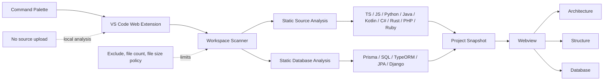

# Project Atlas

Project Atlas는 현재 VS Code에 열려 있는 워크스페이스를 정적으로 분석해 프로젝트의 **Architecture**, **Structure**, **Database** 관계를 한 화면에서 탐색할 수 있게 하는 VS Code Extension입니다. Desktop Extension Host와 Web Extension Host 진입점을 함께 제공합니다.

Command Palette에서 **`Project Atlas: Open Workspace Diagram`**을 실행하면 다이어그램 패널이 열립니다. 분석은 로컬 확장 런타임 안에서 수행되며, 현재 버전은 분석을 위해 소스 원문을 외부 서버로 전송하지 않습니다.

> Project Atlas는 코드를 실행하거나 실제 운영 데이터베이스에 접속하는 도구가 아닙니다. 파일에서 확인되는 정적 패턴을 바탕으로 프로젝트를 이해하기 위한 보조 시각화를 만듭니다.

## 주요 기능

### Architecture

- 워크스페이스에서 감지한 언어와 주요 구성 요소를 요약합니다.
- 소스 파일의 정적 import 및 의존 관계를 기반으로 모듈 간 연결을 구성합니다.
- 분석 과정에서 확정하기 어려운 연결은 추론 결과일 수 있으며, 진단 정보가 제공되는 경우 함께 확인할 수 있습니다.

### Structure

- 폴더와 파일의 계층을 프로젝트 구조로 표시합니다.
- 빌드 산출물, 패키지 캐시, 가상 환경 등은 기본 제외 패턴에 따라 분석 대상에서 제외합니다.
- 파일 수와 개별 파일 크기 제한을 설정해 큰 저장소의 분석 범위를 조절할 수 있습니다.

### Database

- 소스 또는 스키마 파일에서 발견한 엔터티, 테이블, 필드 및 관계를 정적으로 추출합니다.
- Prisma, SQL DDL 및 주요 ORM 선언 패턴을 하나의 관계 그래프로 정리합니다.
- 데이터베이스 정의를 찾지 못한 경우, 임의의 테이블을 만들지 않고 빈 상태 또는 진단을 표시합니다.

### 갱신

- 패널이 열린 상태에서 **`Project Atlas: Refresh Workspace Diagram`** 명령으로 다시 분석할 수 있습니다.
- `projectAtlas.autoRefresh`가 활성화되어 있으면 관련 워크스페이스 파일 변경 후 열린 다이어그램을 자동으로 갱신합니다.
- 자동 갱신은 `projectAtlas.exclude` 패턴을 그대로 따릅니다. 즉 `dist`, `build`, `out`, `target` 같은 빌드 산출물에 쓰기가 발생해도 재분석하지 않습니다.
- 창을 다시 열면 열려 있던 다이어그램 패널이 복원되며, 보기·선택·확대 상태가 유지된 채 새로 분석합니다.

## 현재 지원 범위

아래 항목은 완전한 컴파일러 수준의 의미 분석이 아니라, 파일과 선언에서 확인할 수 있는 정적 패턴을 대상으로 합니다.

| 영역 | 인식 대상 | 분석 예시 |
| --- | --- | --- |
| TypeScript / JavaScript | 소스 구조와 정적 모듈 참조 | `import`, `export ... from`, 정적으로 표현된 `require` |
| Python | 패키지·모듈 구조와 import | `import`, `from ... import ...` |
| Java | 패키지·클래스 구조와 import | `package`, `import`(와일드카드 `import a.b.*` 포함) |
| Kotlin | 패키지·클래스 구조와 import | `package`, `import`, 일반적인 타입 선언 |
| C# | 네임스페이스 선언과 import | `namespace`(블록·파일 범위), `using` |
| Rust | 모듈 선언과 경로 참조 | `mod`, `use crate::` / `self::` / `super::` |
| PHP | 네임스페이스 선언과 import | `namespace`, `use`, 상대 경로 `require`/`include` |
| Ruby | 상대 경로 로드 | `require_relative`, `lib/` 기준 `require` |
| Prisma | Prisma 스키마 | `model`, 필드, 관계 선언 |
| SQL | 정적 DDL | `CREATE TABLE`, 기본 키 및 외래 키 선언 |
| TypeORM | 엔터티 데코레이터 패턴 | 엔터티, 컬럼, 관계 데코레이터 |
| JPA | 엔터티 애너테이션 패턴 | `@Entity`, `@Table`, 식별자 및 관계 애너테이션 |
| Django ORM | 모델 클래스 패턴 | `models.Model`, 필드 및 일반적인 관계 필드 |

한 워크스페이스에 여러 언어와 스키마 형식이 함께 있어도 각각의 분석 결과를 조합할 수 있습니다. 다만 실제 인식 범위는 파일에 명시적으로 드러난 구문과 현재 구현된 휴리스틱으로 제한됩니다.

## 개인정보 및 소스 코드 처리

- 분석은 VS Code의 Web Extension 런타임에서 로컬로 수행됩니다.
- 현재 버전은 원격 분석 API를 호출하거나 소스 원문을 외부 서비스에 업로드하지 않습니다.
- 프로젝트의 모듈, 설정 파일 또는 ORM CLI를 실행하지 않고 파일 내용을 정적으로 읽습니다.
- 제외 패턴, 최대 파일 수, 최대 파일 크기를 통해 읽는 범위를 제한할 수 있습니다.

보안이 중요한 저장소에서는 설치할 VSIX와 확장 소스를 조직 정책에 따라 별도로 검토하는 것을 권장합니다.

## 사용 방법

1. VS Code에서 분석할 프로젝트 폴더 또는 워크스페이스를 엽니다.
2. Command Palette를 엽니다.
   - macOS: `Cmd+Shift+P`
   - Windows/Linux: `Ctrl+Shift+P`
3. **`Project Atlas: Open Workspace Diagram`**을 실행합니다.
4. 열린 패널에서 **Architecture**, **Structure**, **Database** 보기를 전환해 결과를 확인합니다.
5. 파일을 변경한 뒤 즉시 다시 분석하려면 **`Project Atlas: Refresh Workspace Diagram`**을 실행합니다.

분석 대상이 큰 경우 설정에서 파일 수, 파일 크기 또는 제외 패턴을 먼저 조정하십시오.

## 로컬 개발 및 F5 실행

### 요구 사항

- VS Code 1.100.0 이상
- 프로젝트에서 사용하는 Node.js 및 npm 개발 환경

### 실행

```bash
npm install
npm run compile
```

그다음 이 저장소를 VS Code에서 열고 Run and Debug 보기에서 **Run Project Atlas** 구성을 선택한 뒤 `F5`를 누릅니다. 새 Extension Development Host 창에서 분석할 폴더를 열고 다음 명령을 실행합니다.

```text
Project Atlas: Open Workspace Diagram
```

개발 중 번들을 계속 갱신하려면 별도 터미널에서 다음 명령을 사용할 수 있습니다.

```bash
npm run watch
```

`watch`는 번들을 다시 만드는 개발 편의 명령입니다. 타입 검사도 린트도 하지 않으므로, 최종 검증 전에는 반드시 `npm run check`를 별도로 실행하십시오.

## VSIX 빌드 및 설치

VSIX 패키지를 만들려면 다음 명령을 실행합니다.

```bash
npm install
npm run vsix
```

생성된 `.vsix` 파일은 VS Code의 Extensions 보기에서 **Install from VSIX...**를 선택해 설치할 수 있습니다. CLI를 사용하는 경우 실제 생성된 파일명을 지정합니다.

```bash
code --install-extension ./project-atlas-diagrams-0.1.0.vsix
```

버전이 바뀌면 VSIX 파일명도 달라질 수 있습니다. `npm run vsix`는 패키징 도구가 설치되어 있어야 하며, 저장소의 개발 의존성을 설치한 상태에서 실행해야 합니다.

## 설정

VS Code Settings에서 `Project Atlas`를 검색하거나 `settings.json`에 직접 값을 지정할 수 있습니다.

| 설정 | 기본값 | 설명 |
| --- | --- | --- |
| `projectAtlas.maxFiles` | `2500` | 한 번의 스캔에서 분석할 최대 파일 수입니다. 허용 범위는 100–20,000입니다. |
| `projectAtlas.maxFileSizeKb` | `1024` | 분석할 개별 텍스트 파일의 최대 크기(KiB)입니다. 허용 범위는 16–10,240입니다. |
| `projectAtlas.exclude` | 빌드·의존성·가상 환경 제외 glob | 분석에서 제외할 경로를 지정하는 glob 패턴입니다. |
| `projectAtlas.autoRefresh` | `true` | 열린 패널에서 관련 파일 변경 후 자동 갱신할지 결정합니다. |

예시:

```json
{
  "projectAtlas.maxFiles": 5000,
  "projectAtlas.maxFileSizeKb": 2048,
  "projectAtlas.exclude": "**/{node_modules,.git,dist,build,target,vendor,.venv,generated}/**",
  "projectAtlas.autoRefresh": true
}
```

기본 제외 패턴은 다음 범주의 디렉터리를 포함합니다.

```text
node_modules, .git, .hg, .svn, dist, build, out, coverage,
.next, .nuxt, .svelte-kit, target, vendor, .venv, venv, __pycache__
```

## 내부 아키텍처



분석기와 화면은 공통 스냅샷 모델을 경계로 분리됩니다. 워크스페이스 스캐너가 제한 정책에 따라 파일을 수집하고, 소스 및 데이터베이스 분석기가 정적 관계를 구성한 뒤 Webview가 세 가지 보기로 표현합니다.

## 명확한 한계

- **실제 운영 데이터베이스를 보여 주지 않습니다.** DB 서버에 접속하거나 현재 테이블, 데이터, 인덱스, 마이그레이션 적용 상태를 조회하지 않습니다.
- **정적 휴리스틱 분석입니다.** 컴파일러, 언어 서버 또는 각 ORM의 전체 의미 분석과 같은 정확도를 보장하지 않습니다.
- 계산된 경로를 사용하는 dynamic import, 동적 `require`, Python `importlib`, 런타임 모듈 로딩은 놓칠 수 있습니다.
- 리플렉션, 의존성 주입 컨테이너, 애너테이션 프로세서, 코드 생성 결과처럼 런타임 또는 빌드 시점에 만들어지는 관계는 불완전할 수 있습니다.
- 커스텀 테이블·컬럼 네이밍, 사용자 정의 데코레이터/애너테이션, ORM 플러그인, 상속 매핑, 복합 키, 암시적 조인 테이블은 정확히 해석되지 않을 수 있습니다.
- 경로 별칭, 모노레포 패키지 해석, 심볼릭 링크, 조건부 export 및 프레임워크별 자동 연결은 일부가 미해결 관계로 남을 수 있습니다.
- C#·Rust·PHP·Ruby는 선언된 네임스페이스와 관용적인 디렉터리 배치를 전제로 해석합니다. PSR-4 커스텀 매핑, Rust `path` 속성, Ruby `$LOAD_PATH` 조작처럼 규약을 벗어난 배치는 해석하지 못합니다.
- 주석, 문자열 또는 예제 코드가 실제 선언처럼 보이는 경우 오탐이 생길 수 있습니다.
- 제외된 파일, 설정한 크기를 넘는 파일, 최대 파일 수 이후의 파일은 분석 결과에 포함되지 않습니다.
- 생성된 다이어그램은 코드 이해를 돕는 탐색 자료이며 보안 감사, 마이그레이션 검증 또는 운영 설계의 단독 근거로 사용해서는 안 됩니다.

## 검증 명령

| 명령 | 검증 범위 |
| --- | --- |
| `npm run check-types` | TypeScript 타입 검사만 수행합니다. |
| `npm run lint` | ESLint(typescript-eslint 타입 인식 규칙)로 전체 소스를 검사합니다. |
| `npm test` | 테스트용 TypeScript를 빌드하고 Node 테스트를 실행합니다. |
| `npm run compile` | 타입 검사 후 개발용 확장 및 Webview 번들을 생성합니다. |
| `npm run package` | 타입 검사 후 프로덕션 번들을 생성합니다. 테스트는 실행하지 않습니다. |
| `npm run check` | 타입 검사, 린트, 자동 테스트, 프로덕션 번들을 순서대로 검증합니다. |
| `npm run test:extension-host` | 설치된 VS Code의 격리된 Extension Host에서 활성화, 명령, Webview 준비·렌더, fixture 분석, 새로고침을 검증합니다. |
| `npm run check:full` | `check`와 Extension Host 통합 테스트를 모두 실행합니다. |
| `npm run vsix` | 프로덕션 번들 후 설치 가능한 VSIX를 만듭니다. |

일반적인 로컬 검증은 다음 한 줄로 실행합니다.

```bash
npm run check
```

배포 전에는 현재 Mac에 설치된 VS Code까지 포함해 다음 명령을 권장합니다.

```bash
npm run check:full
```

`npm run check:full`은 명령 등록, 패널 생성, Webview 스크립트의 ready 핸드셰이크, fixture 분석, 첫 렌더 패스와 새로고침까지 자동 확인합니다. 다만 픽셀 단위 레이아웃과 실제 대규모 저장소의 체감 성능은 자동으로 판정하지 않으므로, 배포 전에는 F5로 다음 항목을 직접 확인하십시오.

1. 실제 폴더가 열린 상태에서 Open 명령이 패널을 여는지
2. Architecture, Structure, Database 보기가 모두 전환되는지
3. 지원 대상 fixture에서 예상한 노드와 관계가 표시되는지
4. 데이터베이스 선언이 없는 프로젝트에서 빈 상태가 자연스럽게 표시되는지
5. 파일 변경과 수동 Refresh가 최신 결과를 반영하는지
6. 큰 워크스페이스에서 제외 및 제한 설정이 적용되는지

## 라이선스

현재 패키지는 `UNLICENSED` 상태입니다. 별도 라이선스가 정해지기 전에는 재배포 또는 외부 공개에 주의하십시오.
