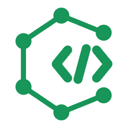

<p align="center">
  
</p>

<h1 align="center">Repogram</h1>

<p align="center">
  Understand an unfamiliar codebase without leaving VS Code.
</p>

<p align="center">
  
  
  
</p>

Repogram reads the workspace you already have open and turns its static structure into practical maps: how modules depend on one another, where to start reading, how calls and branches flow, which interfaces the project exposes, and how its relational or document data models fit together.

It is designed to stay beside your editor. As you move through the code, Repogram follows the active file and keeps the relevant module and its immediate neighborhood in view.

> [!IMPORTANT]
> Repogram is in preview. Its results come from static heuristics, not a compiler, a runtime trace, or a live database. Treat every diagram as a navigational aid and review inferred or unresolved relationships before relying on them.

## Why Repogram?

Most codebase diagrams are snapshots: generate one, look at it once, then watch it drift out of date. Repogram instead works as a live reading companion inside VS Code.

- **Start with the part that matters.** Repogram highlights entry points, dependency hotspots, large source files, apparently unreferenced files, and files without a correspondingly named test.
- **Move from context to detail.** Begin with a repository or subject-area map, then drill down to modules, services, files, tables, or collections.
- **Keep the evidence close.** Select a node to inspect why it exists; open the source directly from the diagram when you need to verify it.
- **Read polyglot workspaces as one system.** Application code, API declarations, infrastructure ports, relational schemas, and document models can appear in the same analysis.
- **Keep source code local.** Repogram reads files inside VS Code. It does not upload source, execute project code, run ORM CLIs, or connect to a database.

## Quick start

Once Repogram is installed, open your first map:

1. Open a project folder or multi-root workspace in VS Code.
2. Select the **Repogram** icon in the Activity Bar.
3. Use the sidebar overview immediately, or select **Open diagram** for the full canvas.
4. Open a source file. Repogram will center the relevant module and mark the active file.

There is no project setup or configuration required. You can also open the canvas with **Repogram: Open Workspace Diagram** from the Command Palette.

## Two views, one analysis

### Sidebar overview

The sidebar is for orientation while you read code. It shows the module containing the active file, the modules that use it, the modules it uses, and a compact summary of the current selection. Search narrows the map without replacing VS Code's Explorer.

The **Review** tab collects results that deserve a human check, including unresolved syntax, inferred or unresolved relationships, and isolated nodes. Each item explains why it was flagged and opens its source when a location is available.

### Diagram panel

The editor panel is the complete, zoomable workspace canvas. Use it to change perspectives, move between scope levels, inspect declarations, and open the source behind a node. Opening the panel does not steal focus from the editor.

Both views share one analysis snapshot, so the workspace is scanned only once.

## Five perspectives

| View | Question it answers | What it shows |
| --- | --- | --- |
| **Architecture** | How is this codebase divided and connected? | Module dependencies derived from imports, grouped first by repository area in larger workspaces. External packages are kept in a separate lane. |
| **Files** | Where should I start reading? | Entry points, highly depended-on files, large files, apparently unreferenced files, test-name gaps, language mix, technologies, package groups, external dependencies, and hotspots. |
| **Flows** | In what order can requests and calls move? | Project and service handoffs, routes, calls, explicit branches, and major I/O operations at project, service/module, or file scope. |
| **Data model** | What data shape does the code declare? | Relational entities, tables, document collections, embedded documents, fields, keys, and relationships, grouped into source-declared subject areas. |
| **Interfaces** | How can the outside world reach this project? | Protocols, ports, endpoints, handlers, topics, queues, socket events, and the declarations from which they were inferred. |

Click once to select and inspect a result. Double-click a source-backed item to open the relevant file and line.

### Files — find where to start reading

Use the codebase overview to identify entry points, heavily depended-on files, large source files, apparently unreferenced files, test-name gaps, language mix, and detected technologies.


### Flows — follow source-backed execution paths

Trace routes, calls, and branches from a project or service down to an individual file. Direct evidence uses solid lines; inferred relationships remain visually distinct and the analysis notes explain what static inspection cannot prove.


### Data model — explore one subject area at a time

Inspect tables, fields, keys, and cross-area relationships without connecting to a live database. Selecting an area or entity reveals the declarations and unresolved targets behind it.


### Interfaces — see how the outside world gets in

Review protocols, endpoints, handlers, and port declarations together. Repogram distinguishes ports bound by code, exposed by images, published by Compose, and supplied by settings.


The same view keeps multiple protocols together when a workspace exposes more than HTTP.


## Follow the active editor

With `repogram.followActiveEditor` enabled, changing files updates both views:

- the sidebar's working context moves to the file and its module;
- **Nearby** keeps the current module or entity and its direct neighbors in focus;
- the Files view marks the card containing the active file;
- the canvas reframes only when the module changes, not on every file change;
- **Whole scope** restores the complete current map.

This behavior can be disabled without turning off analysis.

## Read large systems progressively

Repogram avoids placing every node on one canvas when a declared boundary can provide a more useful first step.

### Architecture scopes

| Scope | Contents |
| --- | --- |
| **Repository map** | One card for each source-declared area, such as `apps/web`, `packages/api`, or `src/features`. Repeated imports between two areas are aggregated. |
| **Repository area** | Every module and internal dependency in the selected area. Outgoing connections are folded into neighboring area cards. |
| **All modules** | The complete module graph for search and whole-system inspection. |

Repository areas come from real paths. Repogram does not invent architectural boundaries merely to make the graph look balanced.

### Flow scopes

| Scope | Evidence |
| --- | --- |
| **Project / service map** | Resolved module imports summarized as service-to-service handoffs. |
| **Services and modules** | Routes, functions, methods, explicit branches, internal calls, and major I/O calls within a module. |
| **Files** | The same evidence narrowed to one file. |

Flow diagrams reserve diamonds for conditions that actually lead to distinct reachable branches. Non-branching conditions and calls remain inside the step that contains them. Only branch edges receive labels (`Yes` and `No`), because direction already communicates ordinary calls and handoffs.

Flows are not runtime traces. Dynamic dispatch, dependency injection, reflection, generated code, and computed imports may be missing or marked as inferred.

### Data-model scopes

Schemas with more than 30 entities open as a subject-area map. Each area card reports its entity count, internal relationships, and outbound relationships. Opening an area expands its own entities and folds cross-area references into neighboring area cards.

Areas are derived from declarations such as schema files, qualified table names, JPA packages, and Django app labels. Small source areas may be folded into a parent directory; a large area is divided further only when its entities declare usable namespaces.

For dense diagrams, cards adapt to the current scope:

| Visible entities | Fields shown on each card |
| --- | --- |
| 40 or fewer | All fields |
| 41–220 | Primary and foreign keys |
| More than 220 | Entity name only |

The complete field list is always available in the details panel.

## Export schema documentation

From the Data model view, select **Export**, or run **Repogram: Export Schema Documentation**. Repogram writes a searchable Markdown documentation set to a location you choose.

The export includes:

- a provenance notice explaining that the result came from static analysis and no database connection was made;
- a subject-area index with internal and cross-area relationship counts;
- one Mermaid diagram per area when it contains 30 or fewer entities;
- tables of entities, fields, types, keys, constraints, and relationships;
- unresolved targets and analysis notes.

This explicit export is the only operation that writes a project document. The exported document has the same limitations as the interactive analysis and should be reviewed against the real database.

## Supported source patterns

Repogram performs pattern-based static analysis. It does not claim compiler-level semantic coverage.

### Module dependencies

| Language | Recognized forms |
| --- | --- |
| TypeScript / JavaScript | `import`, `export ... from`, and statically expressed `require` calls |
| Python | `import` and `from ... import ...` |
| Java / Kotlin | packages, imports, wildcard imports, and common type declarations |
| C# | block-scoped and file-scoped namespaces, plus `using` |
| Rust | `mod`, `use crate::`, `self::`, and `super::` |
| PHP | namespaces, `use`, and relative `require` / `include` |
| Ruby | `require_relative` and conventional `lib/`-based `require` |
| Go | import blocks and module paths from one or more `go.mod` files |
| Swift | imports, including `@testable`, and Swift Package target structure |
| C / C++ | quoted and angle-bracket `#include` directives |
| Dart / Flutter | `import`, `export`, `part`, package imports, and `pubspec.yaml` package names |

Project roots are detected from manifests such as `package.json`, `go.mod`, `pubspec.yaml`, `Cargo.toml`, `pom.xml`, and `Package.swift`. This prevents a repository containing, for example, a Go backend and Flutter client from being treated as only two shallow top-level folders.

### Relational and document data models

| Source | Recognized declarations |
| --- | --- |
| Prisma | models, fields, and relations |
| SQL | `CREATE TABLE`, primary keys, and foreign keys |
| TypeORM | entity, column, and relationship decorators |
| JPA | entities, tables, identifiers, and relationship annotations |
| Django ORM | `models.Model`, fields, and common relationship fields |
| GORM | structs in GORM-using files, tags, embedded `gorm.Model`, relationships, and `TableName()` overrides |
| Drift | `Table` subclasses, column builder chains, references, table names, and primary-key overrides |
| Mongoose / Dynamoose | schemas, models, field options, references, nested objects, and subdocuments |
| Typegoose | `@prop` classes, collection options, references, and embedded document types |
| MongoEngine | documents, embedded documents, fields, references, and collection metadata |
| Beanie | document annotations, links, back-links, indexes, and collection settings |
| Spring Data MongoDB | document classes, convention-mapped fields, IDs, field names, indexes, and DB references |

Document databases require special care: Repogram shows the shape declared by application code, not a schema enforced by the database. Collections may contain older or different shapes, and references may point to deleted documents. Embedded documents are rendered differently from collections, and inferred physical names are identified as such.

### External interfaces

| Protocol or surface | Examples of recognized evidence |
| --- | --- |
| HTTP | Express-style routers; NestJS; Spring MVC; JAX-RS; ASP.NET; Flask; FastAPI; Django; Rails; Symfony; Go routers; axum; actix; rocket; Next.js routes; OpenAPI paths |
| GraphQL | `.graphql` / `.gql` schemas and root `Query`, `Mutation`, or `Subscription` fields |
| gRPC | Protobuf services and RPCs, including request, response, and streaming direction |
| WebSocket / SSE | socket.io, `ws`, NestJS gateways, Spring messaging, FastAPI WebSockets, event-stream responses, and common SSE helpers |
| Brokers | Kafka, AMQP, MQTT, and Redis topics, queues, or channels when the imported client provides enough context |
| Ports | code-level listeners, Docker `EXPOSE`, Compose mappings, Kubernetes ports, and common server settings |

Repogram labels the provenance of port declarations as `binds`, `exposes`, `publishes`, or `setting`. A protocol is attached only when the same source provides evidence or a well-known port permits an explicitly marked inference; otherwise it remains `TCP / other`.

## Privacy and trust boundaries

- Analysis runs locally inside the VS Code extension host.
- Source code is not uploaded to an external service.
- No remote analysis API is called.
- Project code and ORM command-line tools are not executed.
- Repogram does not connect to a development or production database.
- Files such as `.env` are not read for interface discovery.
- Untrusted and virtual workspaces are supported because analysis uses the VS Code workspace file-system API.

Repogram is an exploration tool, not a security audit, migration validator, coverage report, or substitute for production architecture review.

## Refresh and configuration

When `repogram.autoRefresh` is enabled, relevant workspace changes trigger a new analysis. Changes inside the configured exclusion pattern—including common build and dependency directories—are ignored. Use the sidebar refresh button or **Repogram: Refresh Workspace Diagram** to refresh manually.

Open diagrams restore their view, selection, and zoom state when the window is reopened.

| Setting | Default | Description |
| --- | --- | --- |
| `repogram.maxFiles` | `2500` | Maximum files analyzed in one scan. Allowed range: 100–20,000. |
| `repogram.maxFileSizeKb` | `1024` | Maximum size of an analyzed text file in KiB. Allowed range: 16–10,240. |
| `repogram.exclude` | Dependency, build, and tool-cache glob | Paths excluded from analysis. |
| `repogram.autoRefresh` | `true` | Reanalyze after relevant file changes. |
| `repogram.followActiveEditor` | `true` | Follow and mark the active file and module. |

For a large workspace, lower the file limit or exclude generated and vendor-heavy directories:

```json
{
  "repogram.maxFiles": 5000,
  "repogram.exclude": "**/{node_modules,.git,dist,build,target,vendor,.venv,generated}/**"
}
```

## Known limitations

Static analysis can be useful without pretending to know more than the source reveals. Keep these boundaries in mind:

- **Apparently unreferenced is not dead code.** Entry points, convention-loaded files, dependency injection, plugins, and dynamic imports may have no visible static importer.
- **A matching test name is not coverage.** Repogram checks naming correspondence, not whether a test executes or asserts behavior.
- **An empty Interfaces view does not prove that no interface exists.** Runtime registration, environment-only ports, computed topics, and framework plugins may be invisible.
- **Document-model diagrams are not database-enforced schemas.** They describe application declarations only.
- **Inferred ports and relationships require review.** Repogram marks inference when the source does not provide a direct declaration.
- **Custom language conventions can escape the resolver.** Path aliases, conditional exports, symbolic links, custom ORM decorators, table naming, inheritance mapping, composite keys, implicit join tables, PSR-4 overrides, Rust `path` attributes, and Ruby load-path changes may be incomplete.
- **Comments and strings can resemble declarations.** Pattern matching may occasionally produce false positives.
- **Excluded, oversized, or over-limit files do not appear in results.** Review the analysis diagnostics before assuming the map is complete.

## Contributing and feedback

Repogram is a preview, and concrete parser failures are especially valuable. If a module, relationship, endpoint, or entity is missing or incorrect, [open an issue](https://github.com/nanjjang/repogram/issues) and include:

- the language or framework;
- a minimal source example, with private information removed;
- what Repogram displayed;
- what you expected it to display.

For development and verification details, see the [development notes](docs/development.md).

For security-sensitive reports, do not include credentials, private source code, or production data in a public issue.

## License

Repogram is available under the [MIT License](LICENSE).
