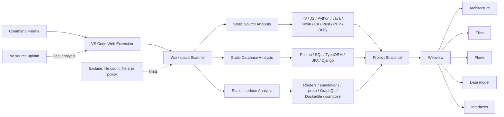

# 개발 노트

이 문서는 Repogram를 직접 빌드하고 검증할 때 필요한 내용입니다. 확장을 사용하는 데에는 필요하지 않습니다 — 사용법은 [README](../README.md)를 보십시오.

## 로컬 개발 및 F5 실행

### 요구 사항

- VS Code 1.100.0 이상
- 프로젝트에서 사용하는 Node.js 및 npm 개발 환경

### 실행

```bash
npm install
npm run compile
```

그다음 이 저장소를 VS Code에서 열고 Run and Debug 보기에서 **Run Repogram** 구성을 선택한 뒤 `F5`를 누릅니다. 새 Extension Development Host 창에서 분석할 폴더를 연 다음, 활동 표시줄의 **Repogram** 아이콘을 누르면 개요가 표시됩니다. 전체 다이어그램이 필요하면 다음 명령을 실행합니다.

```text
Repogram: Open Workspace Diagram
```

개발 중 번들을 계속 갱신하려면 별도 터미널에서 다음 명령을 사용할 수 있습니다.

```bash
npm run watch
```

`watch`는 번들을 다시 만드는 개발 편의 명령입니다. 타입 검사도 린트도 하지 않으므로, 최종 검증 전에는 반드시 `npm run check`를 별도로 실행하십시오.

## VSIX 빌드 및 설치

VSIX 패키지를 만들려면 다음 명령을 실행합니다.

```bash
npm install
npm run vsix
```

생성된 `.vsix` 파일은 VS Code의 Extensions 보기에서 **Install from VSIX...**를 선택해 설치할 수 있습니다. CLI를 사용하는 경우 실제 생성된 파일명을 지정합니다.

```bash
code --install-extension ./repogram-0.1.0.vsix
```

버전이 바뀌면 VSIX 파일명도 달라질 수 있습니다. `npm run vsix`는 패키징 도구가 설치되어 있어야 하며, 저장소의 개발 의존성을 설치한 상태에서 실행해야 합니다.


## 내부 아키텍처



분석기와 화면은 공통 스냅샷 모델을 경계로 분리됩니다. 워크스페이스 스캐너가 제한 정책에 따라 파일을 수집하고, 소스·데이터베이스·인터페이스 분석기가 정적 사실을 구성한 뒤 Webview가 다섯 가지 보기로 표현합니다.


## 검증 명령

| 명령 | 검증 범위 |
| --- | --- |
| `npm run check-types` | TypeScript 타입 검사만 수행합니다. |
| `npm run lint` | ESLint(typescript-eslint 타입 인식 규칙)로 전체 소스를 검사합니다. |
| `npm test` | 테스트용 TypeScript를 빌드하고 Node 테스트를 실행합니다. |
| `npm run compile` | 타입 검사 후 개발용 확장 및 Webview 번들을 생성합니다. |
| `npm run package` | 타입 검사 후 프로덕션 번들을 생성합니다. 테스트는 실행하지 않습니다. |
| `npm run check` | 타입 검사, 린트, 자동 테스트, 프로덕션 번들을 순서대로 검증합니다. |
| `npm run test:extension-host` | 설치된 VS Code의 격리된 Extension Host에서 활성화, 명령, Webview 준비·렌더, fixture 분석, 새로고침을 검증합니다. |
| `npm run check:full` | `check`와 Extension Host 통합 테스트를 모두 실행합니다. |
| `npm run vsix` | 프로덕션 번들 후 설치 가능한 VSIX를 만듭니다. |

일반적인 로컬 검증은 다음 한 줄로 실행합니다.

```bash
npm run check
```

배포 전에는 현재 Mac에 설치된 VS Code까지 포함해 다음 명령을 권장합니다.

```bash
npm run check:full
```

`npm run check:full`은 명령 등록, 패널 생성, Webview 스크립트의 ready 핸드셰이크, fixture 분석, 첫 렌더 패스와 새로고침까지 자동 확인합니다. 다만 픽셀 단위 레이아웃과 실제 대규모 저장소의 체감 성능은 자동으로 판정하지 않으므로, 배포 전에는 F5로 다음 항목을 직접 확인하십시오.

1. 실제 폴더가 열린 상태에서 Open 명령이 패널을 여는지
2. Architecture, Structure, Database 보기가 모두 전환되는지
3. 지원 대상 fixture에서 예상한 노드와 관계가 표시되는지
4. 데이터베이스 선언이 없는 프로젝트에서 빈 상태가 자연스럽게 표시되는지
5. 파일 변경과 수동 Refresh가 최신 결과를 반영하는지
6. 큰 워크스페이스에서 제외 및 제한 설정이 적용되는지
